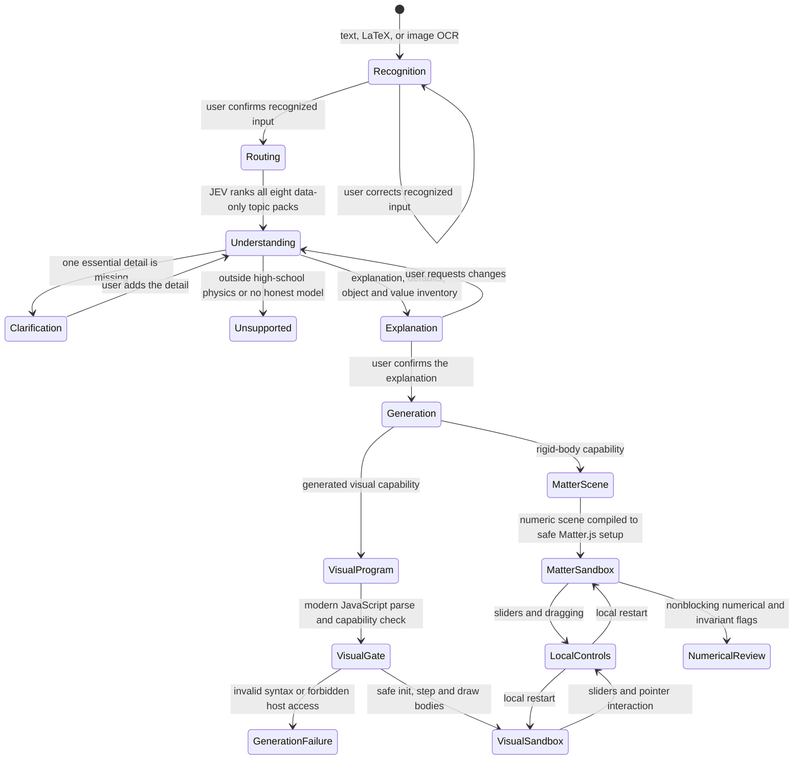

# Simulation creation flow

`/workspace` uses `/api/matter-flow`. Text and raw LaTeX enter directly; images use OCR. Every input reaches a separate recognition confirmation before JEV or semantic interpretation. OCR failure requires correction. JEV supplies a ranking, not a topic hard gate: the model sees compact, data-derived descriptions of every registered capability. The model chooses one capability, asks one essential question when needed, or explains its intended model and disclosed defaults. The user confirms that explanation before generation.

The same understanding response lists each user-requested physical participant, link, spatial relation, and fixed quantity with a source quote. The UI displays these before generation. Potential extraction gaps become review warnings. Backend semantic review after generation also produces warnings; it does not reject a scene because a natural-language detail could not be proven by a generic rule. There is no separate inventory or semantic-proof provider call.

For rigid-body setups, the model returns numeric scene data. The backend derives local controls, checks numeric structure, compiles Matter.js setup code, and checks allowed JavaScript syntax and APIs. The frontend repeats the code gate and executes it in an opaque-origin iframe with a dedicated worker, network disabled and resource limits. The runtime draws requested bodies and links from data, with no saved exercise asset required. Numerical cross checks, conservation checks when applicable, and contact checks flag possible problems after display without stopping it.

For other high-school physics phenomena, the model generates `init`, `step`, and `draw` JavaScript grounded in the confirmed description and selected topic data. The backend checks the response structure and controls and normalizes equivalent function wrappers. Its duplicate visual JavaScript parser was removed; the frontend's modern parser checks syntax and host capabilities before embedding any source in the sandbox. Startup rejection is also reported to the reviewer log. The runtime exposes finite parameters, safe Math calls, local helper functions, flat data destructuring, optional parameter reads, owned-array operations, template labels and drawing primitives. Frontend instrumentation bounds loops, helper calls, primitive string growth, array operations and numeric indexing; the isolated worker also enforces frame, serialized state, drawing and watchdog budgets. The generated model draws locally without a topic-specific asset or code branch. This route carries an explicit **not independently verified** label because it has no separate physics solver.

Sliders restart the existing local model. Dragging is native to the Matter renderer; the visual renderer passes pointer position to its model. Neither action calls JEV or the AI provider. A new description returns to semantic interpretation. Obsolete numerical creation endpoints return HTTP 410; historical replay remains available for existing records.

The application cannot guarantee correct physics for arbitrary descriptions. Model-generated explanations, object inventories, numeric scenes and visual code require user review. Unsafe or structurally invalid generated programs fail clearly; the system does not substitute a different phenomenon or silently retry an asset.
