# Simulation creation flow

```mermaid
stateDiagram-v2
    [*] --> SchemaRoute: user request
    SchemaRoute --> SpecDraft: JEV candidates → LLM selects schema and builds spec
    SpecDraft --> Compatibility: schema cannot represent a stated requirement
    SpecDraft --> RequiredInputs: compatible specification
    Compatibility --> Compatibility: unclear/refused; preserve physics and ask or wait for edit/new problem
    Compatibility --> RequiredInputs: clarified answer or explicitly accepted simplification
    RequiredInputs --> RequiredInputs: missing/invalid dimension; LLM asks again, backend rejects value
    RequiredInputs --> AssetRoute: required inputs valid
    AssetRoute --> AssetReview: substitute proposed; show LLM visual difference
    AssetRoute --> AssetBlocked: no usable catalog asset
    AssetRoute --> Solver: exact/approved visual bindings validated
    AssetReview --> Solver: explicit approval
    AssetReview --> ReviseOrNew: declined
    AssetBlocked --> ReviseOrNew: edit request or start another problem
    ReviseOrNew --> SchemaRoute: revised request
    Solver --> [*]: persist and display simulation
```

The solver is reachable only after compatibility decisions, required schema inputs, structural checks, and any substitute-image approval are complete. `resolutionDecisions` is model output tied to ambiguity codes; the backend checks the declared outcome and omitted object IDs instead of interpreting consent from fixed phrases.
